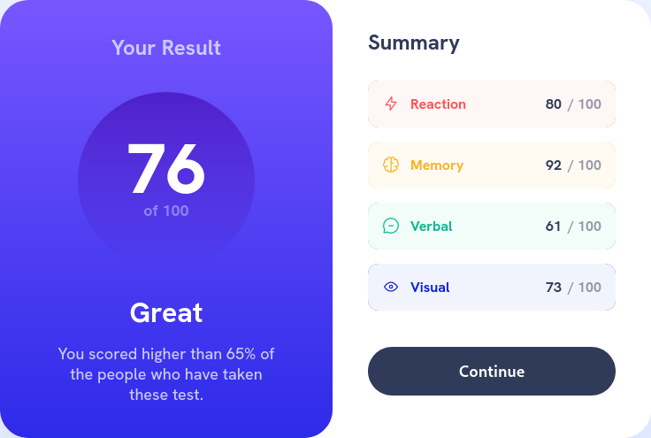

# Frontend Mentor - Results summary component solution

This is a solution to the [Results summary component challenge on Frontend Mentor](https://www.frontendmentor.io/challenges/results-summary-component-CE_K6s0maV). Frontend Mentor challenges help you improve your coding skills by building realistic projects. 

## Table of contents

- [Overview](#overview)
  - [The challenge](#the-challenge)
  - [Screenshot](#screenshot)
  - [Links](#links)
- [My process](#my-process)
  - [Built with](#built-with)
  - [Useful resources](#useful-resources)
- [Author](#author)

## Overview

### The challenge

Users should be able to:

- View the optimal layout for the interface depending on their device's screen size
- See hover and focus states for all interactive elements on the page

### Screenshot

### Links

- Solution URL: [URL]()
- Live Site URL: [URL](https://lisviks.github.io/result-summary-component-frontendmentor/)

## My process

### Built with

- Semantic HTML5 markup
- Sass
- ParcelJS
- Mobile-first workflow
- Flutter - but only for mobile.

### Useful resources

- [ParcelJS](https://parceljs.org)
- [Sass](https://sass-lang.com)
- [Flutter Docs](https://docs.flutter.dev)

## Author

- Website - [Deividas Rimkus](https://deividas.blog)
- Frontend Mentor - [@Lisviks](https://www.frontendmentor.io/profile/Lisviks)
- Twitter - [@DRimkusDev](https://www.twitter.com/DRimkusDev)
- Github - [Lisviks](https://github.com/Lisviks)

